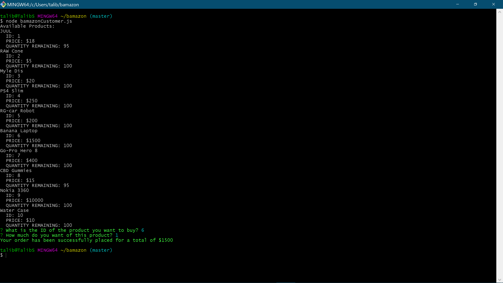

# bAmazon

Once program is ran it will show you all products available for sale then you will be prompted
to pick a product by its ID then you will be prompted for the quantity you would like to purchase.
If quantity is available then your order will be placed.
If quantity is unavailable then you will be informed and your order will be canceled.

